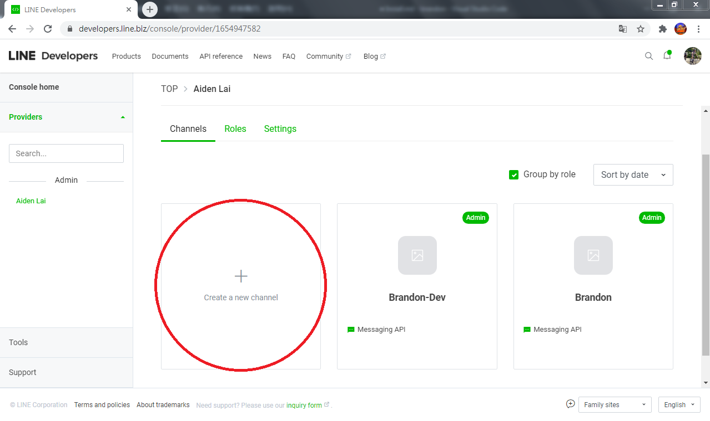

# Install

## 0x00. Requirements

### Environments:
Before you start, you need to prepare:
- A domain name
- A device with static ip
- A SSL encryption

If you doesn't have those above, you can use [ngrok](https://ngrok.com/) to replace.

### Package:
This project use [Django](https://www.djangoproject.com/), [requests](https://requests.readthedocs.io/en/master/) and [line-bot-sdk](https://github.com/line/line-bot-sdk-python).</br>Go check them out if you don't have them locally installed.

## 0x01. Line-Devolope setting
First you need to have an account of [Line-Devolope](https://developers.line.biz/en/).

Then Create a new channel or use the old one.


Get the **Channel secret** and **Channel access token**.


Set your domain name into the **Webhook URL**.


## 0x02. Django setting

Paste the **Channel secret** and **Channel access token** into **settings.py**.


## 0x03. Run server

You can run this Django project directly with following command.

Windows:
```powershell
python manage.py runserver
```

Linux:
```powershell
python3 manage.py runserver
```

Or you can use [Apache](https://httpd.apache.org/) or [Nginx](https://www.nginx.com/) to establish the service.